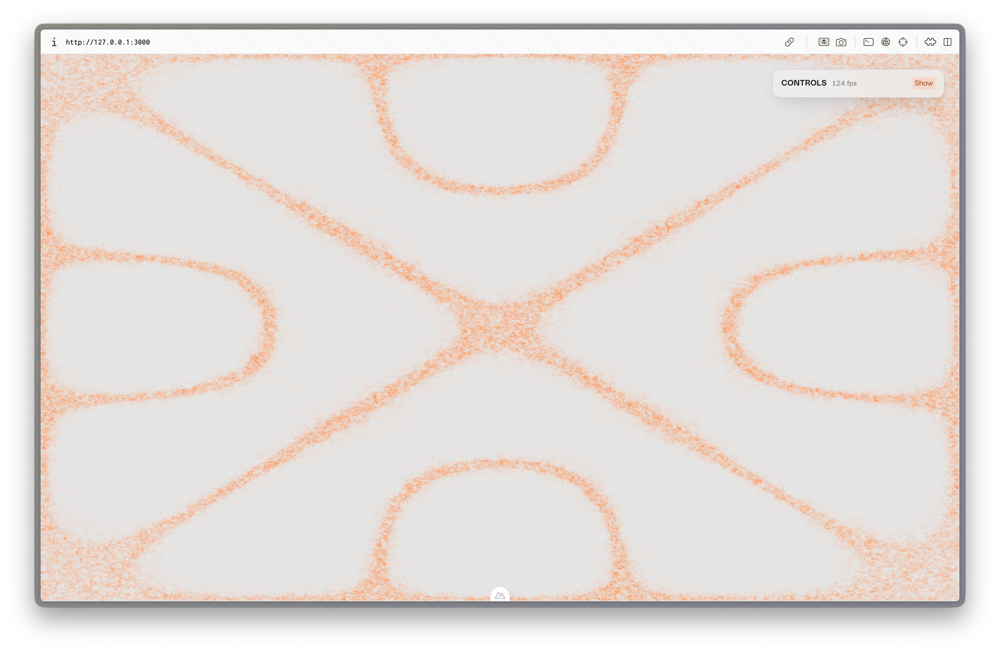
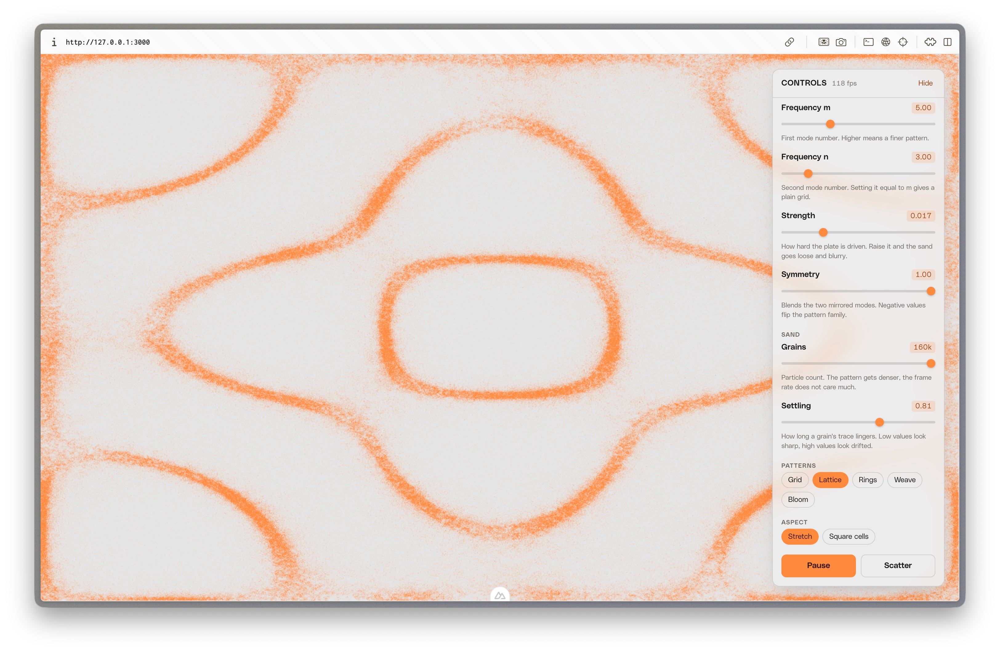
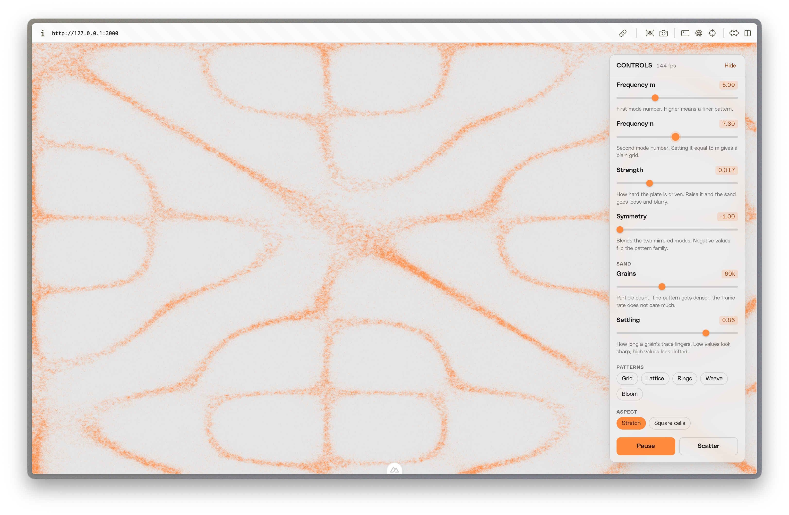
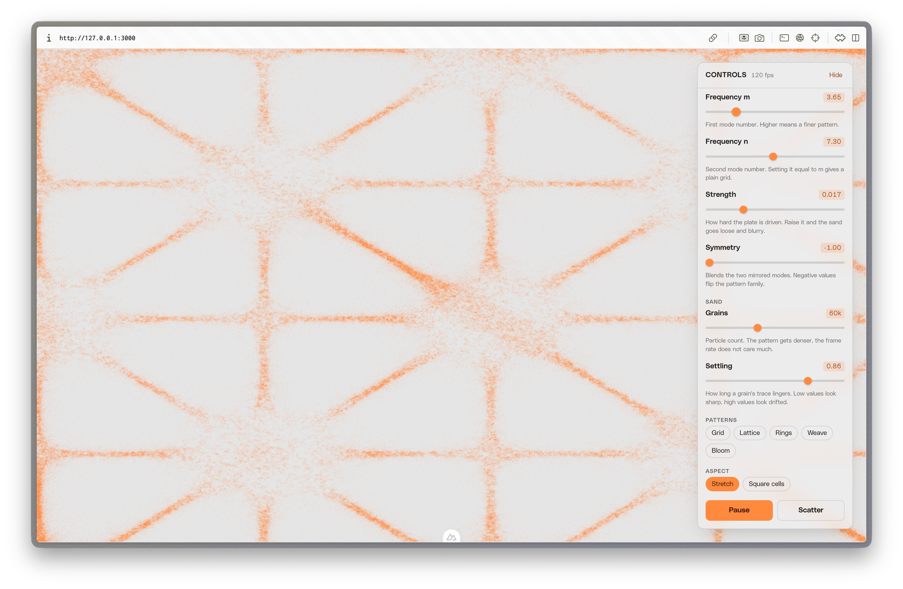

# Chladni patterns

An animated Chladni pattern sand simulation running as a live website background,
built with Nuxt 4 and Vue 3. Orange grains (`#FF8A3D`) settle on a light grey
plate (`#E5E5E5`), with sliders for the vibration frequency.









## Running it

```bash
pnpm install
pnpm dev
```

The dev server listens on <http://127.0.0.1:43117>.

| Script           | What it does                        |
| ---------------- | ----------------------------------- |
| `pnpm dev`       | Dev server with hot reload          |
| `pnpm build`     | Production build                    |
| `pnpm preview`   | Serve the production build          |
| `pnpm lint`      | ESLint (`lint:fix` to autofix)      |
| `pnpm typecheck` | `vue-tsc` over the whole project    |

There are no environment variables, no API calls and no external assets. Fonts
are the system stack.

## How the simulation works

### The field

A vibrating square plate has a closed-form displacement, taken as the
superposition of two modes:

```
f(x, y) = a · sin(πnx) · sin(πmy) + b · sin(πmx) · sin(πny)
```

`m` and `n` are the mode numbers, which is what the **Frequency** sliders
control. `a` and `b` weight the two mirrored modes; the **Symmetry** slider
moves `b` through zero, which swaps the pattern family.

Sand collects where `f(x, y) == 0` — the *nodal lines*, the parts of the plate
that stay still while everything around them moves.

### Why the particles find the nodes on their own

Nothing solves for the nodal lines and nothing draws a curve. Each particle
takes a random step every frame, and the only rule is that the step length is
proportional to the local vibration amplitude:

```ts
const amplitude = Math.abs(chladniAt(x, y, m, n, a, b))
const walk = Math.max(minWalk, vibration * amplitude)
x += (Math.random() * 2 - 1) * walk
y += (Math.random() * 2 - 1) * walk
```

A grain sitting over a violently vibrating region gets thrown a long way and
keeps getting thrown. A grain that happens to wander onto a nodal line has an
amplitude near zero, so its next step is tiny and it stays roughly where it is.
Run that for a few hundred frames and the population concentrates on the nodes.
The figure is not computed, it accumulates — which is also what physically
happens to sand on a real plate.

`minWalk` is the one non-obvious parameter. Without a floor on the step length,
particles freeze in shallow local minima that are not true nodes, and the lines
come out chunky and lifeless.

## Implementation notes

The parts that are less obvious than the physics:

**Particles live in typed arrays, not objects.** Two `Float32Array`s for `x` and
`y`. Per-particle class instances mean chasing 60,000 pointers around the heap
every frame; typed arrays keep it linear and cache-friendly.

**The accumulation buffer varies only alpha.** The `ImageData` has the particle
colour written into every RGB triple once, at allocation, and never touched
again. Only the alpha channel changes. That means "how much sand is here" is a
single number per pixel, fading the whole canvas is one multiply per pixel over
a strided loop, and the plate colour never has to be blended in JavaScript — the
canvas is simply transparent where there is no sand, so the CSS background shows
through.

The fade truncates rather than rounds:

```ts
data[i] = (data[i] * trail) | 0
```

A `Uint8ClampedArray` rounds on assignment, so `3 * 0.94 = 2.82` would round
back to `3` and the faintest trails would never reach zero. Truncating
guarantees they decay.

**Buffer resolution is capped, then upscaled by CSS.** The backing store is
sized to at most ~1.1M pixels regardless of viewport, and the browser scales it
up. Sand is high-frequency detail, so the softening is invisible, and the cost
of a frame no longer depends on how big the window is. Retina would otherwise
quadruple the fill cost of an effect nobody inspects closely.

**Particles reflect off the edges rather than clamping to them.** Clamping pins
every overshooting particle to the exact boundary, which builds a bright rim
that is an artefact of the arithmetic. `x = -x` is unbiased.

**Being a good background citizen.** The canvas is `position: fixed` with
`pointer-events: none` and `aria-hidden`, the loop stops on hidden tabs via
`visibilitychange`, resizes are debounced because reallocating the pixel buffer
is expensive, and `prefers-reduced-motion` gets one settled static pattern
instead of an animation.

**Text readability.** Grain directly behind body copy is tiring to read, so the
content sits on a translucent, blurred card. The pattern stays visible without
competing with the words.

## Layout

```
app/
  lib/chladni.ts              # the simulation: field function, particles, buffer
  lib/presets.ts              # defaults, control ranges, named patterns
  types/chladni.ts            # parameter types
  composables/                # prefers-reduced-motion and page-visibility
  components/
    ChladniBackground.vue     # canvas, animation loop, resize, lifecycle
    ChladniControls.vue       # the control panel
    BaseSlider.vue            # labelled range input
  pages/index.vue             # the demo page
  utils/fieldModel.ts         # immutable v-model helper for one key of an object
```

`lib/chladni.ts` has no Vue in it at all. The component owns state and
lifecycle, the module owns the physics, so dropping the effect into another
project means taking two files and a colour.

## Reusing it

`ChladniBackground` takes its parameters as props and holds no state of its own,
so the controls are entirely optional:

```vue
<ChladniBackground :params="DEFAULT_PARAMS" :render="DEFAULT_RENDER" />
```

For a real site background you would usually drop the panel, pick one preset,
and interpolate `m` and `n` slowly between targets so the figure dissolves and
reforms by itself.

## Credit

The stochastic approach — step length proportional to `|f|`, with a `minWalk`
floor — follows [addiebarron/chladni](https://github.com/addiebarron/chladni).
This version keeps that algorithm and replaces the rendering: typed arrays and a
direct pixel buffer instead of p5's `point()`, an accumulation buffer instead of
a full wipe each frame, and reflecting edges instead of clamped ones.
